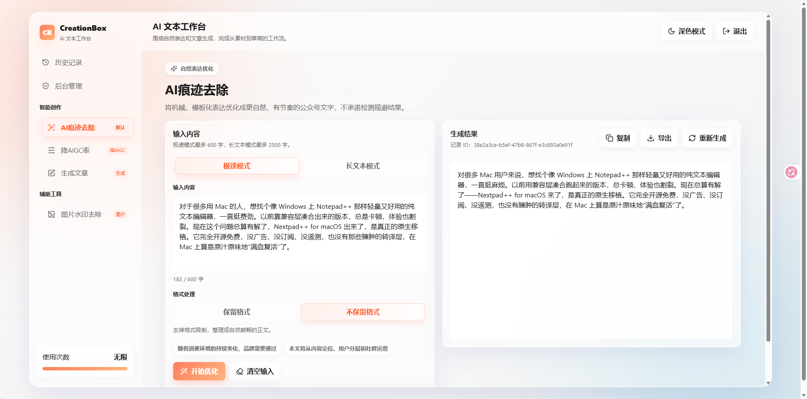
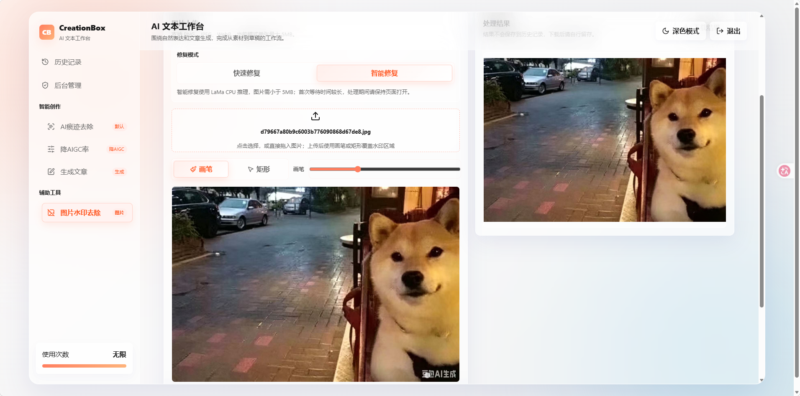

# CreationBox MVP

中文 | [English](#English )

CreationBox 是一个面向文本编写创作的 AI 创作工作台 MVP。项目将原始静态原型升级为可运行的前后端分离应用，提供智能文本创作、历史记录、Markdown 导出、图片水印去除、管理员用户管理和模型配置等基础能力。

本项目为个人学习与演示用途，属于 AI 辅助开发项目，当前版本适合作为功能演示 MVP。

## 功能点

- 智能创作：支持 AI 痕迹去除、降 AIGC 率、公众号文章生成等文本工具。
- 流式生成：后端通过 SSE 返回模型输出，前端实时展示生成结果。
- 历史记录：保存生成任务，可查看、加载、删除历史内容。
- Markdown 导出：生成结果可导出为 Markdown 文件，便于二次编辑。
- 图片水印去除：提供基于 OpenCV 和 LaMa 的两种图像修复方案。
- 模型配置：支持 DeepSeek、OpenRouter 和通用 OpenAI-compatible 接口。
- 用户管理：提供管理员账号、用户创建、状态管理、额度管理、密码重置等简单后台能力。
- 本地演示：未配置真实模型 Key 时自动回退到 mock provider，方便完整体验流程。

## Screenshots





## 项目层级与架构

```text
CreationBox/
├── backend/              # FastAPI 后端服务
│   ├── app/api/          # API 路由：认证、生成、图片、用户、后台管理
│   ├── app/core/         # 配置与安全能力
│   ├── app/db/           # 数据库连接与兼容迁移
│   ├── app/models/       # SQLAlchemy 数据模型
│   ├── app/schemas/      # Pydantic 请求/响应结构
│   └── app/services/     # 模型调用、额度、Prompt、图片修复等业务服务
├── frontend/             # React + Vite 前端应用
│   ├── src/features/     # 创作工作台、历史、去水印、后台、登录等页面
│   ├── src/lib/api/      # 前端 API 客户端
│   ├── src/styles/       # 全局样式与功能样式
│   └── src/types/        # TypeScript 类型
├── Skill/                # 智能创作模块使用的提示词/技能文件
├── docs/                 # PRD、功能清单、架构方案、开发日志
├── infra/nginx/          # Nginx 反向代理配置
└── docker-compose.yml    # PostgreSQL、Redis、API、前端、Nginx 编排
```

整体架构：

- 前端：React + TypeScript + Vite，负责工作台交互、流式结果展示、图片标注和后台管理。
- 后端：FastAPI + SQLAlchemy，负责鉴权、业务 API、SSE 流式生成、额度、历史记录和图片处理。
- 数据层：开发环境默认可使用 SQLite，Docker Compose 环境使用 PostgreSQL；Redis 用于登录限流和生成锁。
- 部署层：Docker Compose 编排 PostgreSQL、Redis、API、前端静态站点和 Nginx。

## 智能创作与提示词

智能创作模块的模型交互强依赖 `Skill/` 目录下的文件：

- `Skill/Humanizer-zh-SKILL.md`：AI 痕迹去除/自然表达优化。
- `Skill/AIGC-Reduce-zh-SKILL.md`：降 AIGC 率文本改写。
- `Skill/Article-Generate-zh-SKILL.md`：公众号文章生成。

后端会读取这些 Skill 文件作为系统提示词或提示词模板的一部分，再结合用户输入构造模型请求。后续可以持续向 `Skill/` 目录添加新的提示词文件，并在后端注册对应工具类型，从而扩展新的模型交互能力。

这种设计把“模型能力设计”和“业务代码”拆开，方便在不大改接口的情况下迭代 Prompt、调整输出风格和增加创作工具。

## 图片水印去除实现

项目提供两种水印去除/图像修复方式：

1. OpenCV 快速修复
   - 前端让用户上传图片，并用画笔或矩形标注需要修复的水印区域。
   - 后端接收原图和 mask，使用 OpenCV 的 `cv2.inpaint` 进行修复。
   - 优点是依赖相对轻、速度快，适合简单水印、纯色背景或纹理不复杂的场景。
2. LaMa 智能修复
   - 后端将图片和 mask 交给 `simple-lama-inpainting` 进行深度学习图像补全。
   - 通过配置限制图片大小、像素数量和并发，避免本地 CPU/GPU 资源被占满。
   - Docker Compose 环境会挂载模型缓存目录，并通过 `INPAINT_LAMA_PRELOAD=true` 在后端启动后后台预热模型，减少首次点击智能修复时的等待。
   - 优点是复杂背景、自然纹理和大面积遮挡场景下通常更自然；缺点是模型依赖更重，首次运行和 CPU 推理较慢。

## 前端设计语言

前端采用“毛玻璃”Mac 风格的设计语言：

- 半透明面板、柔和阴影、细边框和背景模糊。
- 工作台优先，不做营销型落地页。
- 左侧工具导航 + 中央创作工作区 + 结果面板。
- 支持明暗主题、移动端工具切换和响应式布局。
- 视觉上强调轻量、干净、桌面应用感，适合创作型工具的专注体验。

## 用户管理设计

当前用户系统是 MVP 级别的简单设计：

- 默认管理员账号：`admin / admin`。
- 默认关闭公开注册，主要由管理员创建和管理用户。
- 管理员可创建用户、修改状态、设置管理员权限、调整每日额度、重置密码。
- 普通用户使用每日额度限制；管理员默认无限额度。

## 快速启动

Docker Compose：

```powershell
Copy-Item .env.example .env
docker compose up --build
```

打开：

```text
http://localhost:8080
```

默认登录：

```text
Username: admin
Password: admin
```

本地开发：

```powershell
cd backend
pip install -e ".[test]"
uvicorn app.main:app --reload
```

```powershell
cd frontend
npm install
npm run dev
```

Vite 开发服务默认代理 `/api` 到 `http://localhost:8000`。如果你已启动前后端，也可以直接访问：

```text
http://127.0.0.1:5173
```

## 模型配置

未配置真实模型 Key 时，后端会自动使用 mock provider，便于本地演示。

DeepSeek：

```env
AI_PROVIDER=deepseek
DEEPSEEK_API_KEY=your-deepseek-key
DEEPSEEK_MODEL_TEXT=deepseek-v4-flash
DEEPSEEK_THINKING_ENABLED=false
```

OpenRouter：

```env
AI_PROVIDER=openrouter
OPENROUTER_API_KEY=your-openrouter-key
OPENROUTER_MODEL_TEXT=deepseek/deepseek-v4-flash
OPENROUTER_HTTP_REFERER=https://your-site.example
OPENROUTER_APP_TITLE=CreationBox
```

OpenAI-compatible：

```env
AI_PROVIDER=openai-compatible
AI_BASE_URL=https://your-provider.example/v1
AI_API_KEY=your-provider-key
AI_MODEL_TEXT=your-model-id
```

## API 概览

- `POST /api/auth/register`：MVP 管理员模式下禁用。
- `POST /api/auth/login`：登录。
- `POST /api/auth/refresh`：刷新 token。
- `GET /api/me`：当前用户信息与额度。
- `POST /api/generations/stream`：流式生成。
- `GET /api/generations`：历史记录列表。
- `GET /api/generations/{id}`：历史记录详情。
- `DELETE /api/generations/{id}`：删除历史记录。
- `POST /api/generations/{id}/export-markdown`：导出 Markdown。
- `POST /api/images/inpaint`：图片修复/水印去除。
- `/api/admin/*`：管理员用户与模型配置接口。

## 注意事项

- 首版数据库 schema 在 FastAPI 启动时自动创建。
- 链接抓取和文件解析尚未完整实现，参考链接目前主要作为文本上下文传给模型。
- 图片智能修复依赖较重，LaMa 模式在 CPU 环境下可能较慢。
- 上线前务必替换默认账号密码、JWT 密钥、CORS 配置和真实模型 Key。

---

## English

CreationBox is an AI writing workspace MVP for text creation workflows. It turns an original static prototype into a runnable full-stack application with AI-assisted writing tools, streaming generation, history records, Markdown export, image watermark removal, basic admin user management, and model configuration.

This project is built for personal learning and MVP demonstration. It is suitable for showcasing an AI product workflow, but it is not production-ready.

## Features

- AI writing tools: AI trace reduction, AIGC-rate reduction, and article generation.
- Streaming generation: the backend streams model output through SSE and the frontend renders results in real time.
- History records: generated content can be saved, viewed, loaded, and deleted.
- Markdown export: generated results can be exported as Markdown files for further editing.
- Image watermark removal: supports both OpenCV-based fast inpainting and LaMa-based intelligent inpainting.
- Model configuration: supports DeepSeek, OpenRouter, and generic OpenAI-compatible endpoints.
- User management: includes basic admin account management, user status, quota control, password reset, and role flags.
- Local demo mode: when no real model API key is configured, the backend falls back to a mock provider.

## Architecture

```text
CreationBox/
├── backend/              # FastAPI backend service
│   ├── app/api/          # API routes for auth, generation, images, users, and admin
│   ├── app/core/         # Configuration and security
│   ├── app/db/           # Database session and compatibility migrations
│   ├── app/models/       # SQLAlchemy models
│   ├── app/schemas/      # Pydantic request and response schemas
│   └── app/services/     # AI provider, quota, prompt, and image-processing services
├── frontend/             # React + Vite frontend
│   ├── src/features/     # Workspace, history, watermark removal, admin, and auth pages
│   ├── src/lib/api/      # Frontend API clients
│   ├── src/styles/       # Global and feature styles
│   └── src/types/        # TypeScript types
├── Skill/                # Prompt and skill files used by AI writing tools
├── docs/                 # Product notes, feature list, architecture notes, and development log
├── infra/nginx/          # Nginx reverse proxy configuration
└── docker-compose.yml    # PostgreSQL, Redis, API, frontend, and Nginx orchestration
```

- Frontend: React, TypeScript, and Vite provide the workbench UI, streaming result display, image-mask editing, and admin pages.
- Backend: FastAPI and SQLAlchemy handle authentication, APIs, SSE generation, quotas, history records, and image processing.
- Data layer: local development can use SQLite, while Docker Compose runs PostgreSQL. Redis is used for login rate limiting and generation locks.
- Deployment: Docker Compose starts PostgreSQL, Redis, the API service, the frontend service, and Nginx.

## AI Skills and Prompts

The AI writing module depends on prompt files under the `Skill/` directory:

- `Skill/Humanizer-zh-SKILL.md`: AI trace reduction and natural expression optimization.
- `Skill/AIGC-Reduce-zh-SKILL.md`: AIGC-rate reduction and text rewriting.
- `Skill/Article-Generate-zh-SKILL.md`: article generation.

The backend loads these files as part of the system prompt or prompt template, then combines them with user input to build model requests. More prompt files can be added later, and new tool types can be registered in the backend to extend model-interaction capabilities.

## Image Watermark Removal

CreationBox provides two image inpainting approaches:

1. OpenCV fast inpainting
   - The frontend lets users upload an image and mark the watermark area with a brush or rectangle.
   - The backend receives the image and mask, then calls OpenCV `cv2.inpaint`.
   - This approach is lightweight and fast, suitable for small watermarks and simple backgrounds.

2. LaMa intelligent inpainting
   - The backend sends the image and mask to `simple-lama-inpainting` for deep-learning-based completion.
   - Image size, pixel count, and concurrency are limited by configuration to protect local CPU/GPU resources.
   - Docker Compose mounts a persistent model cache and enables `INPAINT_LAMA_PRELOAD=true`, so the backend warms the model in the background after startup.
   - LaMa usually works better for complex backgrounds and larger masked areas, but dependencies are heavier and CPU inference can be slower.

## Design Language

The frontend uses a frosted-glass Mac-style design language:

- Translucent panels, soft shadows, subtle borders, and background blur.
- Workspace-first layout instead of a marketing landing page.
- Left navigation, central creation workspace, and result panel.
- Light and dark themes, mobile tool switching, and responsive layout.
- A lightweight desktop-app feeling for focused writing workflows.

## User Management

The current user system is intentionally simple for the MVP:

- Default admin account: `admin / admin`.
- Public registration is disabled by default.
- Admin users can create users, update status, grant admin permissions, adjust daily quotas, and reset passwords.
- Regular users are limited by daily quota; the default admin has unlimited quota.

## Quick Start

Docker Compose:

```powershell
Copy-Item .env.example .env
docker compose up --build
```

Open:

```text
http://localhost:8080
```

Default login:

```text
Username: admin
Password: admin
```

Local backend:

```powershell
cd backend
pip install -e ".[test]"
uvicorn app.main:app --reload
```

Local frontend:

```powershell
cd frontend
npm install
npm run dev
```

The Vite dev server proxies `/api` to `http://localhost:8000`. If both services are running locally, open:

```text
http://127.0.0.1:5173
```

## Model Configuration

When no real model key is configured, the backend automatically uses the mock provider for local demos.

DeepSeek:

```env
AI_PROVIDER=deepseek
DEEPSEEK_API_KEY=your-deepseek-key
DEEPSEEK_MODEL_TEXT=deepseek-v4-flash
DEEPSEEK_THINKING_ENABLED=false
```

OpenRouter:

```env
AI_PROVIDER=openrouter
OPENROUTER_API_KEY=your-openrouter-key
OPENROUTER_MODEL_TEXT=deepseek/deepseek-v4-flash
OPENROUTER_HTTP_REFERER=https://your-site.example
OPENROUTER_APP_TITLE=CreationBox
```

OpenAI-compatible:

```env
AI_PROVIDER=openai-compatible
AI_BASE_URL=https://your-provider.example/v1
AI_API_KEY=your-provider-key
AI_MODEL_TEXT=your-model-id
```

## API Overview

- `POST /api/auth/register`: disabled in MVP admin-only mode.
- `POST /api/auth/login`: login.
- `POST /api/auth/refresh`: refresh token.
- `GET /api/me`: current user and quota information.
- `POST /api/generations/stream`: streaming generation.
- `GET /api/generations`: generation history list.
- `GET /api/generations/{id}`: generation detail.
- `DELETE /api/generations/{id}`: delete a history item.
- `POST /api/generations/{id}/export-markdown`: export Markdown.
- `POST /api/images/inpaint`: image inpainting and watermark removal.
- `/api/admin/*`: admin user and model configuration APIs.

## Notes

- The initial database schema is created during FastAPI startup.
- Link crawling and full file parsing are not fully implemented yet; reference links are currently passed to the model as text context.
- LaMa-based image inpainting has heavier dependencies and may be slow on CPU.
- Before deployment, replace the default account password, JWT secret, CORS config, and real model keys.
