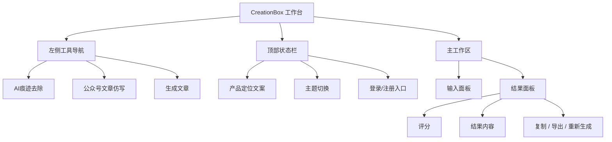
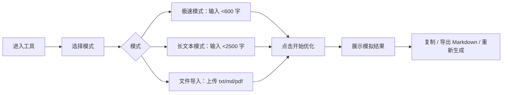
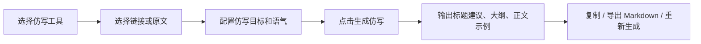
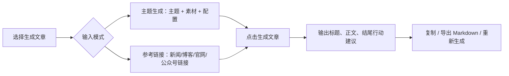

# CreationBox 原型图说明

本文档用于指导 Axure 或 Figma 复刻当前初版原型。当前可交互 HTML 原型文件为：`gemini-code-1779778219667.html`。

## 1. 画布与断点

| 类型 | 建议尺寸 | 说明 |
| --- | --- | --- |
| Desktop | 1440 x 960 | 默认设计画布 |
| Tablet | 1024 x 768 | 左侧导航可保留或切换顶部工具条 |
| Mobile | 390 x 844 | 左侧导航改为横向工具切换 |

## 2. 页面结构



## 3. Desktop 线框图

```text
+--------------------------------------------------------------------------------+
| Sidebar              | Topbar: 高效整理公众号内容表达        [主题] [登录/注册] |
|----------------------|---------------------------------------------------------|
| CB CreationBox       | Tool Header                                             |
|                      | [工具标签]  AI痕迹去除                                  |
| 核心工具             | 将机械、模板化表达改写成更自然的公众号文字              |
| > AI痕迹去除         |                                                         |
|   公众号文章仿写     | +------------------------------+ +--------------------+ |
|   生成文章           | | 输入面板                     | | 结果面板           | |
|                      | | [模式切换]                   | | [评分] [操作按钮] | |
| 今日免费次数         | | 输入/链接/文件控件           | | 空态/加载/结果     | |
| [进度条]             | | 示例 chips                   | | 对比 / 洞察        | |
|                      | | [生成] [清空]                | |                    | |
|                      | +------------------------------+ +--------------------+ |
+--------------------------------------------------------------------------------+
```

## 4. Mobile 线框图

```text
+--------------------------------------+
| 高效整理公众号内容表达               |
| [主题] [登录/注册]                   |
|--------------------------------------|
| [AI痕迹去除] [仿写] [生成文章]       |
|--------------------------------------|
| 工具标签                              |
| AI痕迹去除                            |
| 工具说明                              |
|--------------------------------------|
| 输入面板                              |
| [模式切换]                            |
| [输入控件]                            |
| [生成] [清空]                         |
|--------------------------------------|
| 结果面板                              |
| [评分]                                |
| [复制] [导出 Markdown] [重新生成]     |
| 结果内容                              |
+--------------------------------------+
```

## 5. 组件规范

| 组件 | 规范 |
| --- | --- |
| 导航项 | 高度不低于 48px，选中态使用浅蓝底和主色文字 |
| 按钮 | 高度不低于 44px，主要按钮使用主色填充 |
| 输入框 | 明确 label，不依赖 placeholder 作为唯一说明 |
| 结果卡片 | 标题栏 + 内容区结构，内容支持换行 |
| Toast | 右下角浮层，2.4 秒自动消失 |
| 主题切换 | 明暗主题共用同一布局，仅切换颜色变量 |

## 6. 页面状态

### 6.1 初始态

- 结果区显示空态图标和提示。
- 复制、导出 Markdown、重新生成按钮禁用。
- AI痕迹去除默认选中极速模式。

### 6.2 加载态

- 点击生成后按钮文案变为“生成中...”。
- 结果区展示 loading 状态。
- 操作按钮保持禁用。

### 6.3 成功态

- 展示评分、正文结果、处理前/处理后、编辑洞察。
- 启用复制、导出 Markdown、重新生成。
- 今日免费次数减少一次。

### 6.4 错误态

- 错误信息显示在输入面板底部。
- 空输入、字数超限、文件格式错误均不进入 loading。

## 7. 交互流程

### AI痕迹去除



### 公众号文章仿写



### 生成文章



## 8. Figma 页面建议

建议建立 5 个 Frame：

1. `Desktop / AI痕迹去除 / 初始态`
2. `Desktop / AI痕迹去除 / 成功态`
3. `Desktop / 公众号文章仿写 / 成功态`
4. `Desktop / 生成文章 / 参考链接模式`
5. `Mobile / 工作台`

建议建立组件：

- SidebarNavItem
- ModeTab
- PrimaryButton
- SecondaryButton
- InputPanel
- ResultPanel
- ResultBlock
- Toast

## 9. Axure 页面建议

建议使用动态面板：

| 动态面板 | State |
| --- | --- |
| ToolPanel | AI痕迹去除、公众号文章仿写、生成文章 |
| InputModePanel | 极速、长文本、文件导入、链接、原文、主题 |
| ResultPanel | 空态、加载态、成功态 |
| ThemePanel | Light、Dark |

主要交互：

- 点击左侧导航切换 `ToolPanel`。
- 点击模式按钮切换 `InputModePanel`。
- 点击生成按钮切换 `ResultPanel`：空态 -> 加载态 -> 成功态。
- 点击清空按钮重置输入和结果区。
- 点击导出 Markdown 在 Axure 中用 Toast 模拟反馈。
